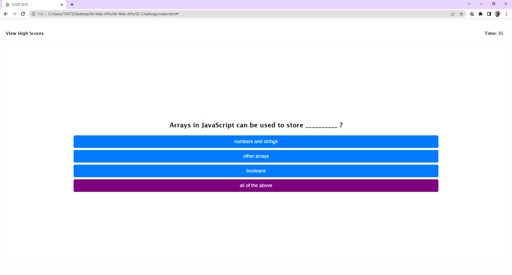

# Title:

Web APIs - Code Quiz

## About Project:

It is a coding challenge to develop an interactive coding base quiz which is based on timer sensitive, multiple choices questions.

## Tech:

HTML 
CSS 
JAVASCRIPT

## ScreenShots:

## Links

* The URL of the deployed application.

https://asrabilal.github.io/JSPasswordGenerator/

* The URL of the GitHub repository that contains your code. Give the repository a unique name and include a README file that describes the project.

https://github.com/asrabilal/JSPasswordGenerator.git

© 2022 Asra Solution Sevices, Inc.
